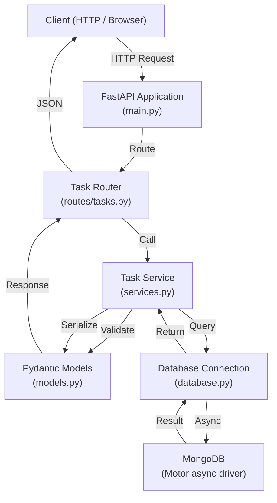
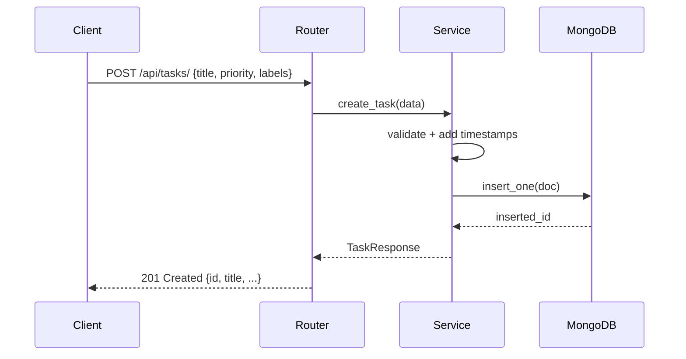

# Personal Task Tracker — Architecture

## System Overview

Python + FastAPI + MongoDB ашигласан REST API backend.

## Architecture Diagram



## Module Description

| Module | Файл | Үүрэг |
|--------|------|-------|
| App Entry | `main.py` | FastAPI instance, CORS, lifespan, router бүртгэл |
| Database | `database.py` | Motor async client, connect/close |
| Models | `models.py` | Pydantic schema — TaskCreate, TaskUpdate, TaskResponse |
| Service | `services.py` | CRUD бизнес логик, MongoDB query |
| Router | `routes/tasks.py` | HTTP endpoint-ууд, query parameter |

## Data Flow



## Layer Architecture

```
┌─────────────────────────────┐
│        HTTP Layer           │  FastAPI routes, request/response
├─────────────────────────────┤
│       Business Layer        │  services.py — CRUD logic
├─────────────────────────────┤
│        Data Layer           │  database.py + Motor driver
├─────────────────────────────┤
│         MongoDB             │  tasktracker database
└─────────────────────────────┘
```

## API Endpoints

| Method | Path | Тайлбар |
|--------|------|---------|
| POST | `/api/tasks/` | Task үүсгэх |
| GET | `/api/tasks/` | Жагсаалт + filter/search |
| GET | `/api/tasks/{id}` | Нэг task |
| PATCH | `/api/tasks/{id}` | Засах |
| DELETE | `/api/tasks/{id}` | Устгах |
| GET | `/api/tasks/labels` | Label жагсаалт |
| GET | `/health` | Health check |
